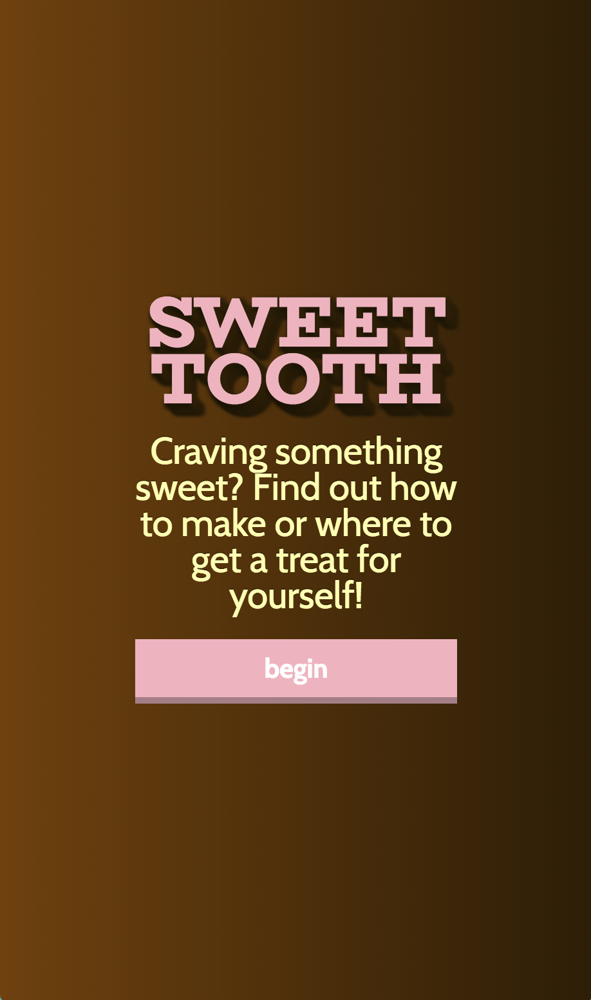
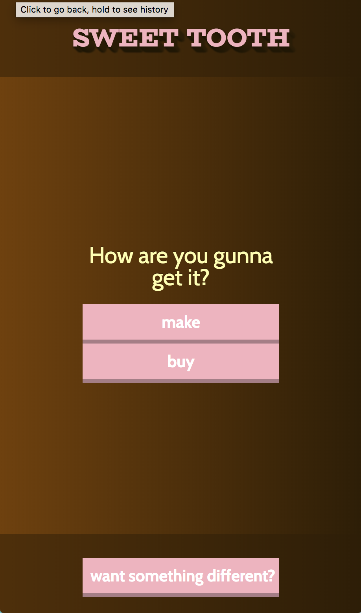
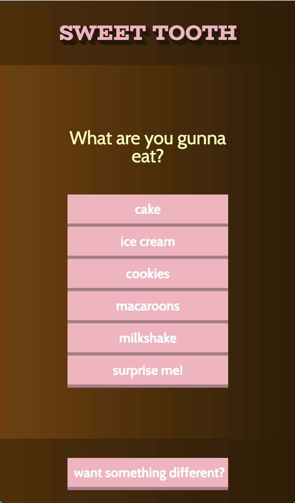
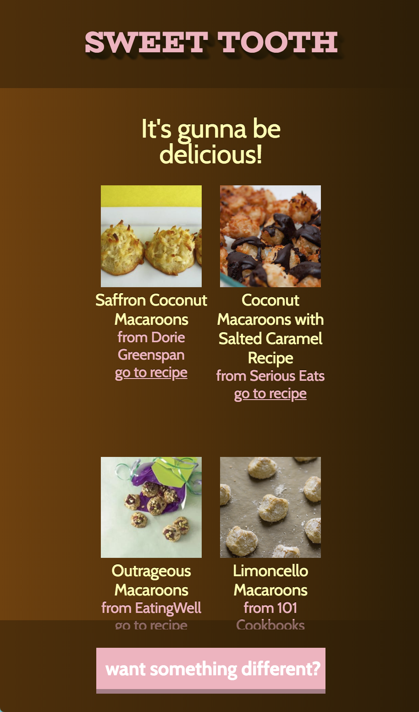

<b>Sweet Tooth: Dessert App</b> 
Thinkful API Capstone

<b>Built With</b> 
Front-End: 
HTML, CSS, Javascript, jQuery 
APIs: 
<a href="https://api.foursquare.com/">Foursquare Places</a> & <a href="https://api.edamam.com/">Edamam Recipes</a>

<b>Features</b> 
First, have a sweet tooth!!
Decide whether you want to make your treat or get it nearby.
Pick your treat or be surprised!
Get a list of either recipes or locations near you.

<a href="https://sans-amanda.github.io/Dessert-API-Final/">Live App</a>

